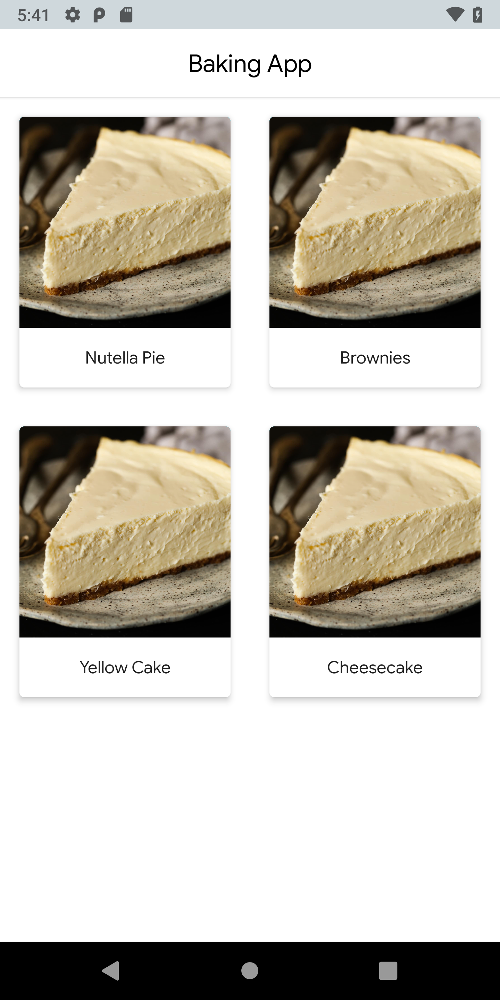
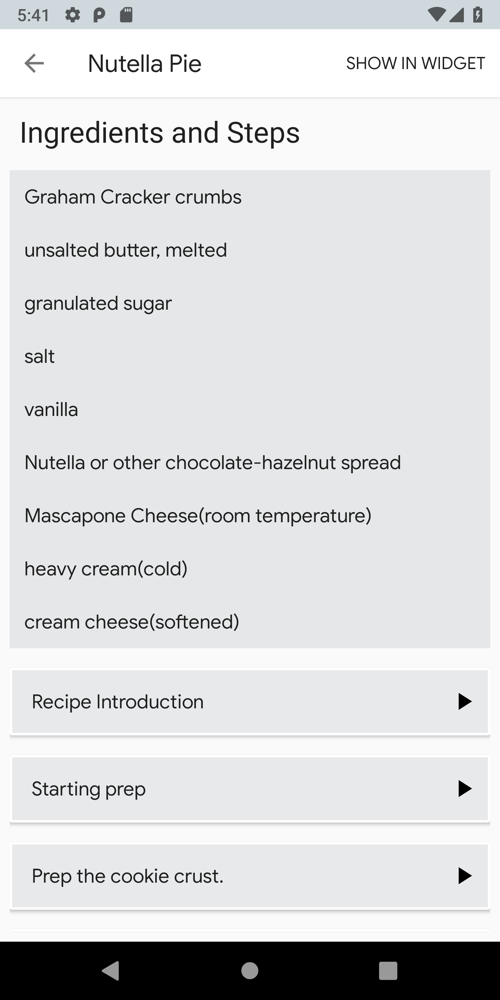
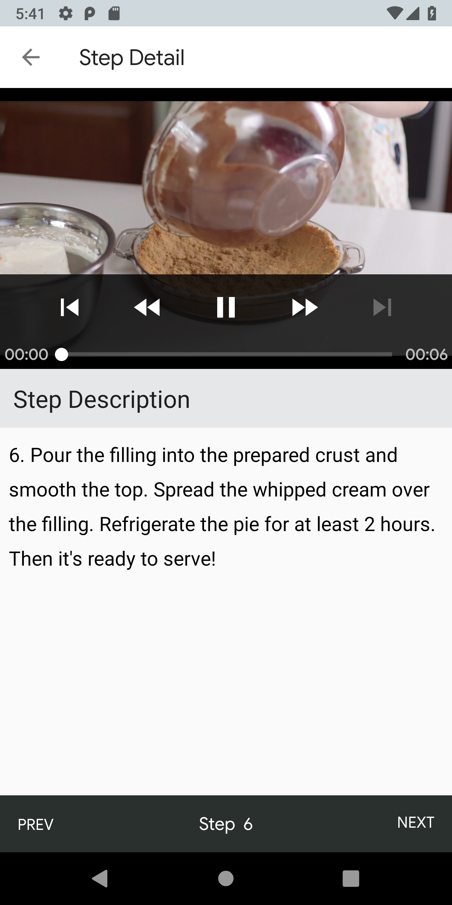
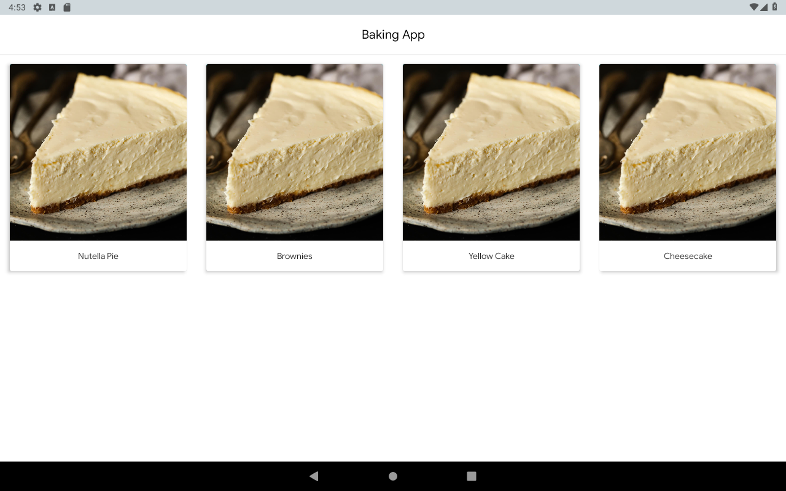
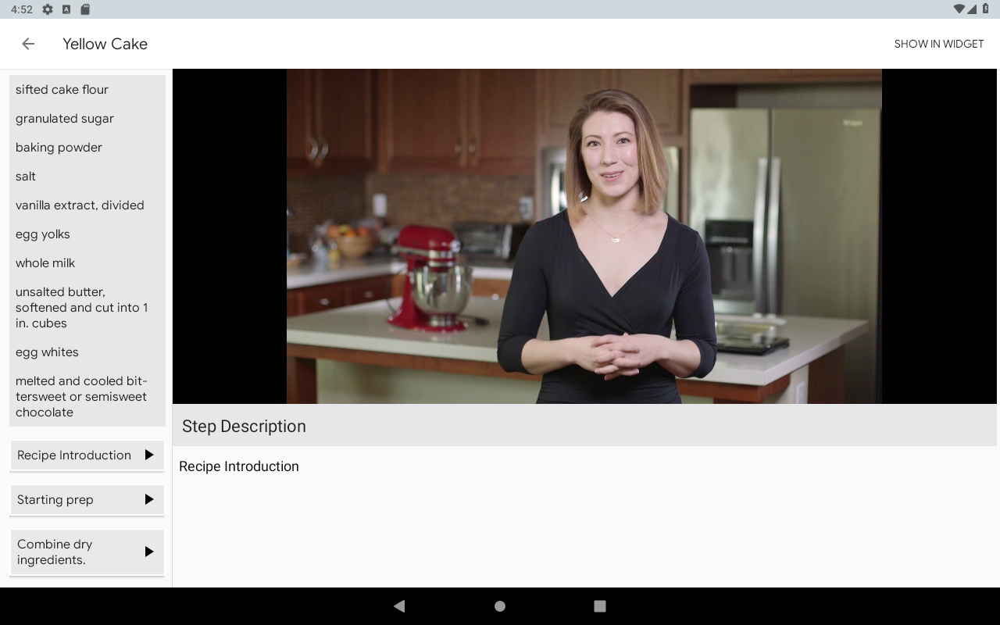

# BakingApp
The BakingApp displays a list of recipes, ingredients required to make it, and steps plus video tutorials on how to make the recipe.
It also has a home screen widget that displays the ingredients of a recipe that the user chooses.

#### This is the third project in the Udacity Nanodegree programme 2018

## Features
* Local persistence using room DB
* MVVM architecture 
* Material design
* Master detail fragment layout
* Fragment interface callbacks for navigation
* Error handling for missing JSON data
* Homescreen widget
* Video playback/streaming with Exoplayer
* UI tests with Espresso

<h2 align="left">Screenshots</h2>
<h4 align="center">

## Getting Started
To run the project, check the prerequisites below, then clone the repo to your Android studio or download the zip

## Prerequisites
*   Android Studio IDE 3.0+
*   Android SDK v28
*   Android Build Tools v28.0.3
*   Gradle 4.6

## Libraries
*   [Retrofit 2](https://github.com/square/retrofit)
*   [Gson](https://github.com/google/gson)
*   [LiveData](https://developer.android.com/topic/libraries/architecture/livedata)
*   [ViewModel](https://developer.android.com/topic/libraries/architecture/viewmodel)
*   [Room](https://developer.android.com/topic/libraries/architecture/room)
*   [Glide](https://github.com/bumptech/glide)
*   [DataBinding 2.0](https://developer.android.com/topic/libraries/data-binding)
*   [ShimmerLayout](https://github.com/facebook/shimmer-android)
*   [Exoplayer](https://github.com/google/ExoPlayer)
*   [Espresso](https://developer.android.com/training/testing/espresso)

## License
This project is licensed under the Apache License 2.0 - See: http://www.apache.org/licenses/LICENSE-2.0.txt

